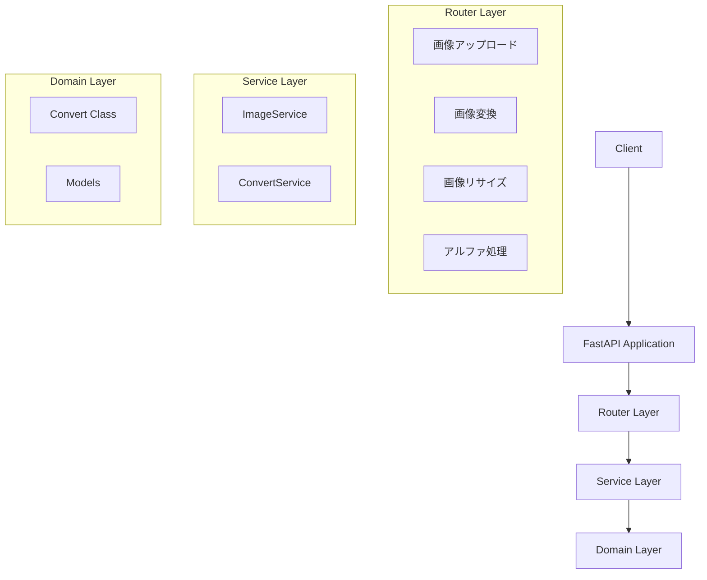
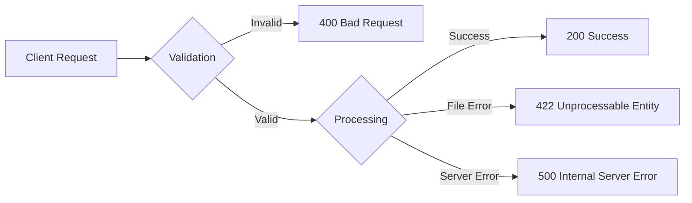

# FastAPI移行計画

## 1. アーキテクチャ設計



## 2. エンドポイント設計

### APIエンドポイント

```plaintext
POST /api/v1/images/upload        - 画像アップロード
POST /api/v1/images/convert       - パレットによる画像変換
POST /api/v1/images/resize        - 画像リサイズ
POST /api/v1/images/alpha         - アルファチャンネル処理
GET  /api/v1/palettes            - 利用可能なパレット一覧取得
```

## 3. 実装計画

### Phase 1: プロジェクト構造の整理

```
src/
├── api/
│   ├── __init__.py
│   ├── routes/
│   │   ├── __init__.py
│   │   └── image.py
│   └── models/
│       ├── __init__.py
│       └── image.py
├── services/
│   ├── __init__.py
│   ├── image_service.py
│   └── convert_service.py
├── domain/
│   ├── __init__.py
│   └── convert.py
└── main.py
```

### Phase 2: 依存関係の整理

- FastAPI関連パッケージの追加（python-multipart, pydantic）
- エラーハンドリングミドルウェアの実装
- バリデーションの実装

### Phase 3: エンドポイントの実装

1. リクエスト/レスポンスモデルの定義
   - ImageUploadRequest
   - ConversionRequest
   - ResizeRequest
   - AlphaProcessingRequest
2. 各エンドポイントの実装
   - ファイルアップロード処理
   - 画像変換処理
   - リサイズ処理
   - アルファチャンネル処理
3. バリデーション
   - ファイルサイズ制限
   - 対応フォーマット制限
   - パレット選択のバリデーション

### Phase 4: セキュリティとパフォーマンス

1. CORSの設定
2. レート制限の実装
3. キャッシング戦略の検討
4. ログ機能の実装

## 4. エラーハンドリング設計



## 5. レスポンス形式の標準化

```json
{
    "status": "success|error",
    "data": {
        "file_url": "処理後の画像URL",
        "processing_time": "処理時間（ms）",
        "parameters": {
            "palette": "使用したパレット名",
            "resize_ratio": "リサイズ比率（該当する場合）"
        }
    },
    "error": {
        "code": "ERROR_CODE",
        "message": "エラーメッセージ"
    }
}
```
